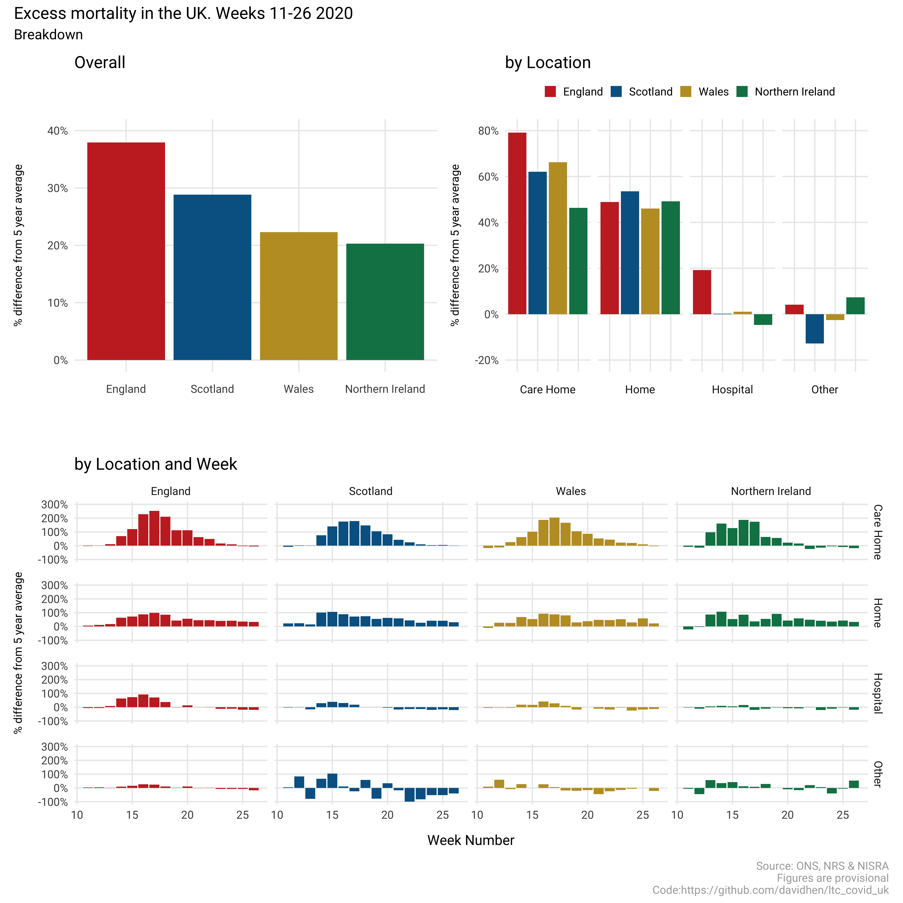
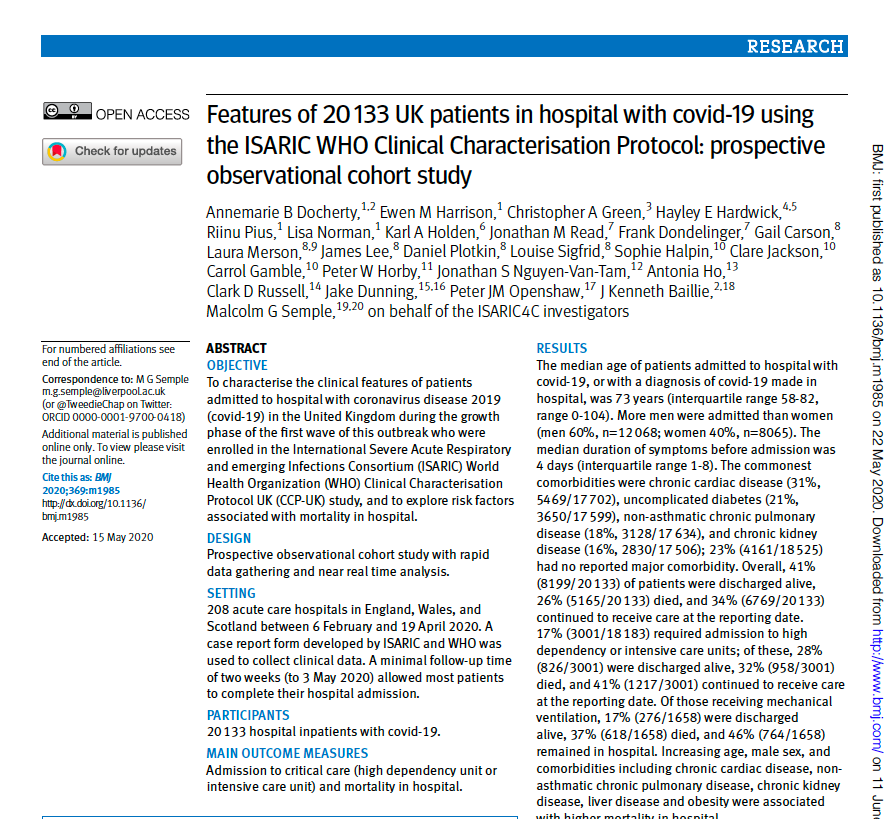
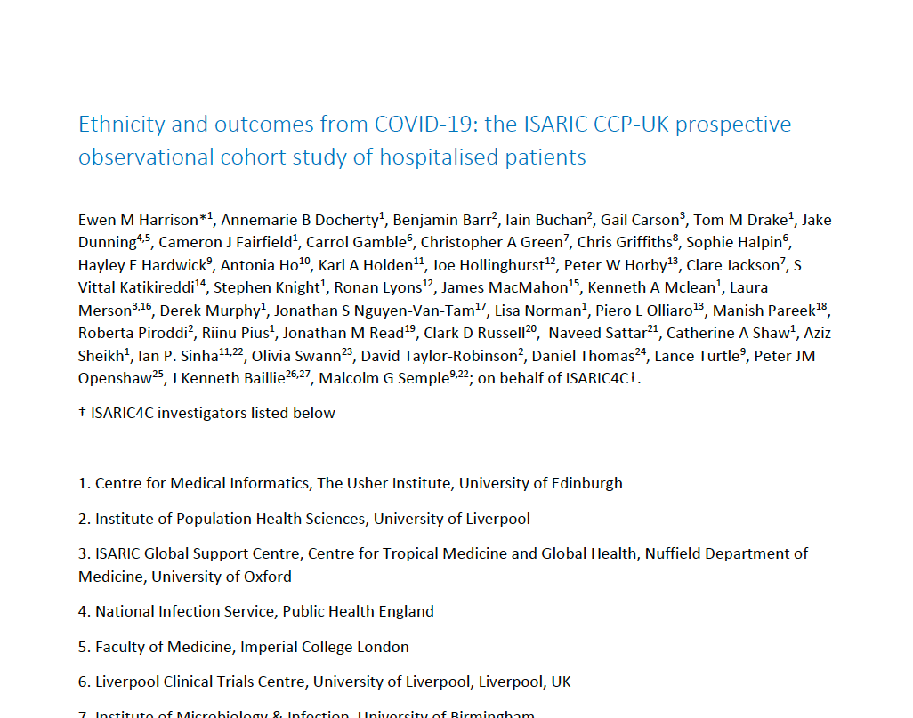
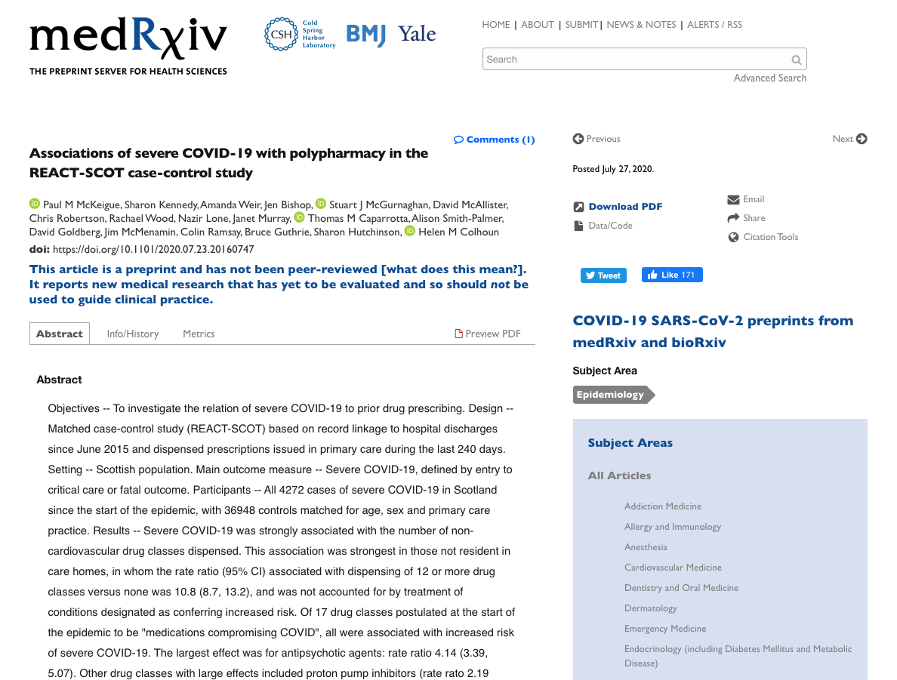
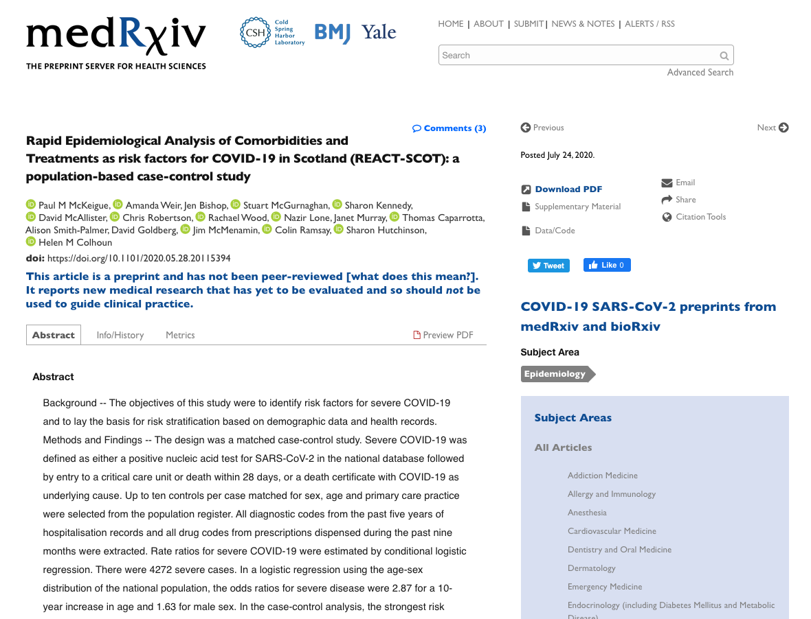
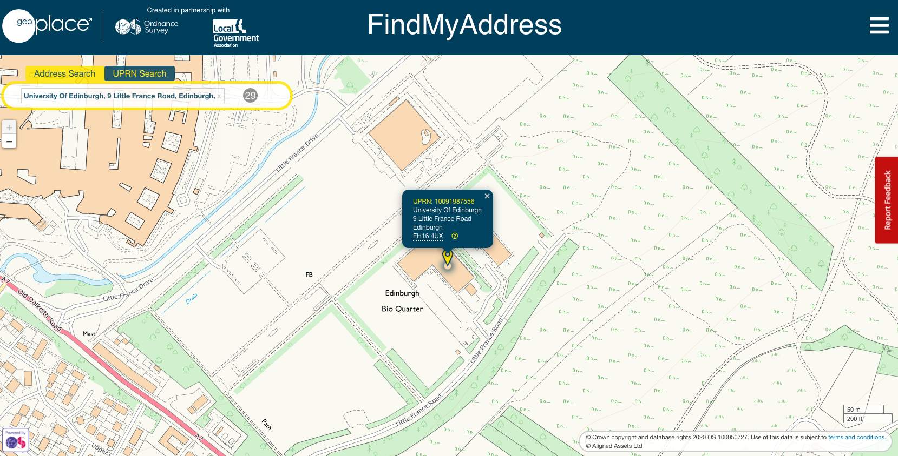
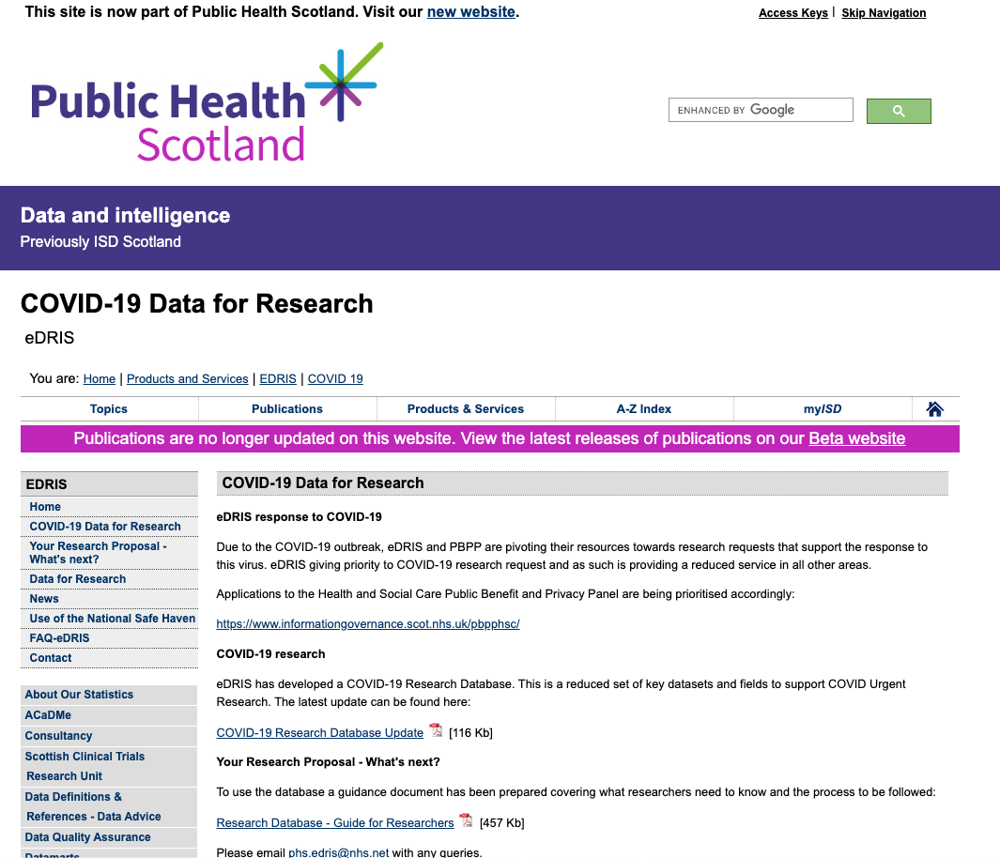
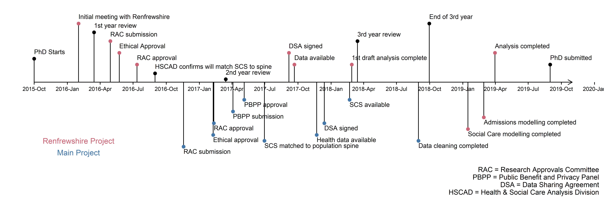

```{r setup, include=FALSE}
options(htmltools.dir.version = FALSE)
```
## About me

.pull-left[
**Research Fellow at** 

 and


]
--

.pull-right[

]


---
## About me
.pull-left[

]

--

.pull-right[
* **PhD at Urban Big Data Centre (University of Glasgow)**

<br/>
* **Completed data linkage project involving social care data (Social Care Survey)**

<br/>
* **Member of Data and Intelligence advisory group for Scottish Government**
]

---
class: inverse, center, middle

# Outline

---
class: centre, middle

- ###Care Home Mortality Project
--
   
- ###Data Quality Issues
--

- ###Thoughts on the expedited application process for COVID-19 projects


---
background-image: url("assets/care_home_1.png")
background-size: cover

class: center, bottom, inverse

# Care Homes and COVID-19 Deaths

---

## Background

Almost half of all deaths attributable to COVID-19 in Scotland (and the wider UK) occurred in Care Homes. Despite this, most published research has focussed on the non-Care Home population. 

There are a couple of **possible** reasons for this.

1. Care Home residents can be difficult to identify in routine datasets

1. The immediate research research response was focussed on those most likely to benefit from treatment.<sup>*</sup>

<br/>
There are even instances of studies where care home data is available (even if not of excellent quality), but analysis is presented with this population removed. 

.footnote[[*] This was not explicitly decided anywhere but reflects my own observations and opinion] 

---
## Background

```{r out.width="70%", eval=TRUE, fig.align='center', echo=FALSE}

```


---
## Background

.pull-left[
### Example 1


]

--
.pull-right[
### Example 2


]

---
## Background

.pull-left[
### Example 3


]

--
.pull-right[
### Example 4


]

---

## Background

### Motivating factors (recap)

<br/>
* **Most studies have concentrated on the *non*-care home population**

<br/>

* **Where they have reported on care home residents, the CHI flag has been used for indentification- this is not entirely accurate**

---
## Background

### What is UPRN?




---
## Methods

### Aim

**To characterise the sociodemographic and health features of those over the age of 65 that have been identified as contracting COVID-19 and their associations with mortality**

<br/>

Main study period runs from 1st March - 30th June 2020

<br/>
Utilises the new COVID-19 Research Dataset and expedited approvals process

---
## Methods

### Data Sources

.pull-left[
* CHI database
  - Demographics
  - CHI Care Home Flag
  - UPRN (not yet available)
* NRS Deaths
* UCD deaths
* ECOSS
* PIS
* Primary Care (not yet available)
]

.pull-right[
* Diabetes
* SICSAG
* Unscheduled Care (using CUP IDs)
 - SMR01
 - A & E
 - GP OOH
 - SAS
 - NHS24]


---
## Results

--
<br/>

```{r out.width="80%", eval=TRUE, fig.align='center', echo=FALSE}
knitr::include_graphics("https://media.giphy.com/media/pPhYIDiYzOGSA/giphy.gif")
```

---
class: left, top

# Data Quality

---
## Cleaning Data

* Not a huge amount to say here, except that....

* The bottom line is that when a dataset is received **every** variable needs checked
 - Unique values
 - Spread (spurious values)
 - Missing Data (what sort?)
 
* Examples
 - Too many categories
 - Negative count values
 - "DUMMY" variables
 
---
## Cleaning Data

```{r echo=FALSE}
library(tweetrmd)
include_tweet("https://twitter.com/jseabold/status/1311640342631002119")
```

### ...because twitter is the fount of all knowledge (obvs)


---
## Cleaning Data

### Project structure


        directory/
        -- 01_functions
        -- 02_scripts
        -- 03_raw_data
        -- 04_research
        ---- 01_import_and_clean
        ---- 02_descriptive_stats
        ---- 03_models
        ---- 04_reports
        -- 05_derived_data
        ---- 01_clean_data
        ---- 02_tables
        ---- 03_plots
        ---- 04_models
        -- README.md
        -- naming_protocol.md
---
## Cleaning Data

### Naming variables

* There is a really useful blog on naming variables by Emily Riederer [here](https://emilyriederer.netlify.app/post/column-name-contracts/)

* Can be cumbersome in a large project (like mine) but I think it is worth it. I have adapted her approach to better fit my project.
--

 - Level 1 Measure types e.g. `id`, `n`, `amt`, `val`, `dt`, `tm`, `cat`
 - Level 2 Data source e.g. `chi`, `pis`, `nrsdeaths`, `ucddeaths` `smr1` etc.
 - Level 3 Details e.g. `age`, `sex`, `los`, `arrive` etc.

--

.pull-left[
* Examples
 - `cat_chi_sex`
 - `n_chi_chlos`
 - `n_smr1_los` 
 - `dt_nhs24_arrive` 
 - `cat_chi_la`
 ]
 
--
 .pull-right[
 * Works well with `dplyr` "select helpers"
  - `select(starts_with("cat"))`
  - `select(contains("los"))`
  - `select(contains("smr1") & starts_with("cat"))`
  
]  
---
class: left, top

# COVID-19 & PBPP

---

## The Old PBPP Process

.pull-left[]
--

.pull-right[]

---
## PBPP

### Research Data Scotland


---
## PBPP

### Timelines



---
## PBPP

### Will it continue?


---

class: center, middle

## Thanks!

### Any questions?

Slides created via the R package [**xaringan**](https://github.com/yihui/xaringan) and available from [this link](https://davidhen.github.io/eDRIS_talk_20201007/#1).

Twitter: @_davidhen

